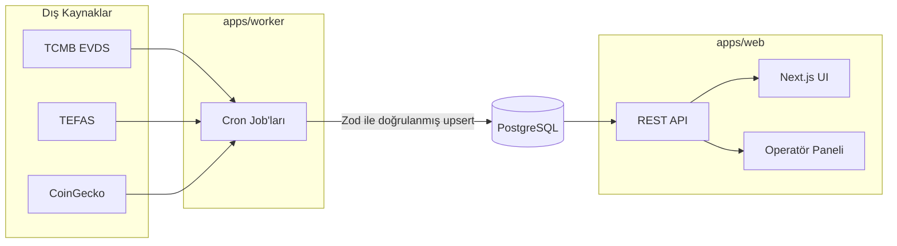

# Terazi

[](https://github.com/selimdlkc-1/Scales/actions/workflows/ci.yml)


Döviz (USD/TRY, EUR/TRY), gram altın, kripto para (BTC, ETH, SOL, BNB, XRP) ve
TEFAS yatırım fonlarının **TL bazında, TÜFE ile enflasyondan arındırılmış
reel getirisini** tek bir tabloda ve normalize edilmiş bir grafikte
karşılaştıran; **read-only, hesapsız** bir vitrin uygulaması.

Yüksek enflasyon ortamında nominal getiri karşılaştırması yanıltıcıdır —
Terazi tüm varlık sınıfları için tutarlı bir reel-getiri metodolojisiyle bu
karşılaştırmayı tek ekranda sunar. **Yatırım tavsiyesi vermez**; yalnızca
geçmiş veriyi gösterir.

## Neden Terazi

Bu proje bir trafik/ölçek gösterisi değil, bir **mühendislik pratikleri**
vitrinidir ([P-004]). Öncelik UI cilası değil, veri katmanının doğruluğu ve
dayanıklılığıdır:

- **İdempotent worker job'ları** — aynı `(asset_id, as_of_date)` çifti için
  tekrar çalışma tek satıra upsert edilir, retry/backoff ve graceful
  degradation ile.
- **Parasal alanlarda daima `DECIMAL`/`NUMERIC`** — hiçbir hesaplamada
  `float` kullanılmaz.
- **Dış kaynak verisi asla doğrulamasız yazılmaz** — TCMB/TEFAS/CoinGecko
  yanıtları DB'ye gitmeden önce Zod şemasından geçer.
- **Gerçek unit test disiplini** — hesaplama katmanı (`packages/core`)
  %90+, uygulama katmanları %60+ coverage hedefiyle geliştirilir.
- **Savunma katmanlı güvenlik** — Basic Auth ile korunan operatör paneli,
  merkezi CORS/CSP config, rate limiting, secret maskeleme.

## Ekran Görüntüleri

_Frontend geliştirmesi tamamlandıkça eklenecek._

## Mimari



Ziyaretçi tarayıcısı hiçbir zaman dış kaynaklara doğrudan istek atmaz; tüm
okuma kendi API/DB'sinden servis edilir. Detay: [`docs/mimari-kararlar.md`](./docs/mimari-kararlar.md) [CODE-002].

## Monorepo Yapısı

```
apps/
  web/        # Next.js (App Router) — app/api, lib/services, lib/repositories
  worker/     # veri toplama job'ları (tcmb, tefas, coingecko)
packages/
  core/       # hesaplama fonksiyonları, Zod şemaları, Prisma client/schema
docs/         # spec — tek doğruluk kaynağı
.claude/      # agent kuralları (rules) ve görev prosedürleri (skills)
```

## Tech Stack

| Katman         | Teknoloji                                                               |
| -------------- | ----------------------------------------------------------------------- |
| Dil            | TypeScript uçtan uca                                                    |
| Frontend       | Next.js (App Router), Tailwind CSS, shadcn/ui, Recharts, TanStack Table |
| Backend        | Next.js API Routes (düz REST, versiyonsuz)                              |
| Worker         | Ayrı Node.js process, cron-tetiklemeli                                  |
| Veritabanı     | PostgreSQL 16+ · Prisma                                                 |
| Doğrulama      | Zod (API query + dış kaynak yanıt şeması, tek kaynak)                   |
| Monorepo       | pnpm workspaces                                                         |
| Çalışma zamanı | Node.js 22 LTS, React 19, Prisma 5+                                     |

## Local Kurulum

```bash
pnpm install
docker compose up -d                          # lokal PostgreSQL
cp .env.example .env                          # değerleri doldur, bkz. docs/09_DEV_WORKFLOW.md §7
pnpm --filter core prisma migrate dev          # şemayı uygula
pnpm --filter core prisma db seed              # asset_classes / assets referans verisi
pnpm --filter web dev                          # http://localhost:3000
```

Worker job'larını lokalde elle tetiklemek için:

```bash
pnpm --filter worker run:tcmb
pnpm --filter worker run:tefas
pnpm --filter worker run:coingecko
```

Adım adım tam prosedür ve env değişken tablosu: [`docs/09_DEV_WORKFLOW.md`](./docs/09_DEV_WORKFLOW.md).

## Test ve Kalite

```bash
pnpm -w lint            # ESLint + Prettier
pnpm -w test:coverage   # Vitest, coverage eşikleriyle
pnpm -w build           # apps/web + apps/worker
```

CI sırası (bloklayıcı): **lint → test → build**; bağımsız olarak
**dependency taraması** (Dependabot + `pnpm audit`, kritik/yüksek zafiyet
build'i bloklamaz, uyarır) ve **Playwright smoke e2e** çalışır.

| Katman                                | Coverage hedefi |
| ------------------------------------- | --------------- |
| `packages/core` (hesaplama + şemalar) | %90+            |
| `apps/web`                            | %60+            |
| `apps/worker`                         | %60+            |

Detay: [`docs/08_TESTING_STRATEGY.md`](./docs/08_TESTING_STRATEGY.md).

## Kapsam Dışı (v1)

Kullanıcı hesabı/auth/rol, portföy takibi, BIST hisse, bildirim/alarm, canlı
fiyat push/polling, al/sat sinyali, i18n, native mobil, üçüncü parti
analytics/error-tracking. Detay ve gerekçe: [`docs/mimari-kararlar.md`](./docs/mimari-kararlar.md).

## Dokümantasyon

Bu proje, kodlama agent'larının okuyup uygulayabileceği kapsamlı bir spec
seti ile geliştirilir — tek doğruluk kaynağı [`docs/`](./docs):

| Doküman                                                                 | İçerik                        |
| ----------------------------------------------------------------------- | ----------------------------- |
| [`mimari-kararlar.md`](./docs/mimari-kararlar.md)                       | Karar ID kaynağı (ADR'ler)    |
| [`00_PROJECT_OVERVIEW.md`](./docs/00_PROJECT_OVERVIEW.md)               | Ürün tanımı, kapsam, kısıtlar |
| [`01_DOMAIN_MODEL.md`](./docs/01_DOMAIN_MODEL.md)                       | Domain terminolojisi          |
| [`02_DATABASE_SCHEMA.md`](./docs/02_DATABASE_SCHEMA.md)                 | Veritabanı şeması             |
| [`03_API_CONTRACTS.md`](./docs/03_API_CONTRACTS.md)                     | REST sözleşmeleri             |
| [`04_BACKEND_SPEC.md`](./docs/04_BACKEND_SPEC.md)                       | Backend/worker mimarisi       |
| [`05_FRONTEND_SPEC.md`](./docs/05_FRONTEND_SPEC.md)                     | Frontend mimarisi             |
| [`06_SCREEN_CATALOG.md`](./docs/06_SCREEN_CATALOG.md)                   | Ekran kataloğu                |
| [`07_SECURITY_IMPLEMENTATION.md`](./docs/07_SECURITY_IMPLEMENTATION.md) | Güvenlik uygulaması           |
| [`08_TESTING_STRATEGY.md`](./docs/08_TESTING_STRATEGY.md)               | Test stratejisi               |
| [`09_DEV_WORKFLOW.md`](./docs/09_DEV_WORKFLOW.md)                       | Geliştirme iş akışı           |
| [`10_IMPLEMENTATION_ROADMAP.md`](./docs/10_IMPLEMENTATION_ROADMAP.md)   | Faz/iterasyon yol haritası    |

Agent çalışma kuralları için: [`CLAUDE.md`](./CLAUDE.md), [`.claude/rules/`](./.claude/rules/), [`.claude/skills/`](./.claude/skills/).

## Yasal Uyarı

Terazi bir yatırım danışmanlığı aracı değildir; hiçbir ekranda "al/sat/iyi
seçenek/önerilir" ifadesi veya sıralama bazlı öneri üretilmez. Geçmiş
performans gelecekteki getiriyi göstermez.
