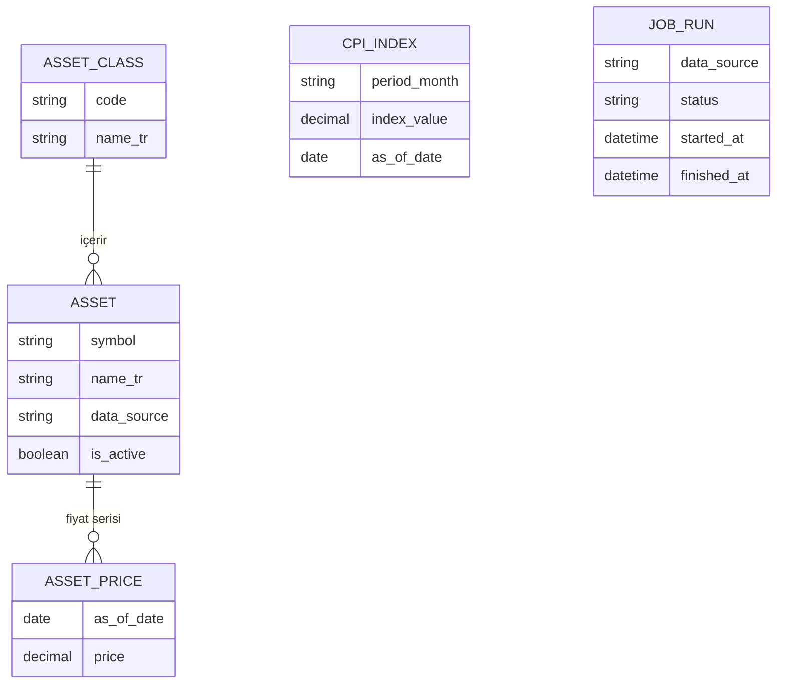
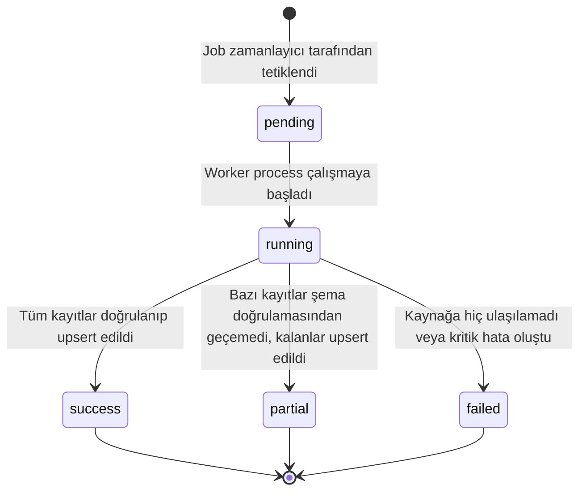

# 01. Domain Model — Terazi

## 1. Domain Sözlüğü

| Türkçe | English (kod) | Tanım |
| --- | --- | --- |
| Varlık sınıfı | `asset_class` | Döviz, altın, kripto, yatırım fonu gibi üst kategori |
| Varlık | `asset` | Karşılaştırılabilir tekil enstrüman (örn. USD/TRY, BTC, belirli bir TEFAS fonu) |
| Fiyat noktası | `asset_price` | Bir varlığın belirli bir tarihteki (`as_of_date`) TL cinsinden fiyatı |
| TÜFE endeksi | `cpi_index` | Aylık Tüketici Fiyat Endeksi değeri, reel getiri hesabının enflasyon arındırma girdisi |
| Veri tarihi | `as_of_date` | Bir fiyat/veri noktasının ait olduğu gerçek tarih |
| Nominal getiri | `nominal_return` | İki `as_of_date` arasındaki fiyat değişiminden hesaplanan, enflasyon arındırılmamış getiri |
| Reel getiri | `real_return` | `nominal_return`'ün TÜFE ile enflasyondan arındırılmış hali |
| Normalize edilmiş getiri | `normalized_return` | Dönem başını 100 kabul eden endeksli getiri serisi (grafik girdisi) |
| Dönem | `period` | Karşılaştırma için seçilen zaman aralığı (`1m`/`3m`/`1y`/`3y`/`5y`) |
| İş çalıştırması | `job_run` | Bir veri toplama worker job'ının tek bir yürütülme kaydı |
| Veri kaynağı | `data_source` | Dış veri sağlayıcı (`tcmb`, `tefas`, `coingecko`) |

## 2. Entity Kataloğu

### 2.1 `AssetClass`

**Sorumluluk:** Varlıkları üst kategoriye ayırmak (döviz, altın, kripto, yatırım fonu). Karşılaştırma tablosundaki filtreleme ve gruplamanın temelidir.

**Sahiplik:** Statik referans verisi; seed ile oluşturulur, worker tarafından değiştirilmez.

**Yaşam döngüsü:** Uygulama ömrü boyunca sabittir (4 kayıt: `fx`, `gold`, `crypto`, `fund`). Yeni bir varlık sınıfı eklemek mimari karar gerektirir ([P-007] güncellemesi).

### 2.2 `Asset`

**Sorumluluk:** Karşılaştırılabilir tekil bir enstrümanı temsil eder (USD/TRY, BTC, belirli bir TEFAS fonu vb.). Fiyat serisinin (`AssetPrice`) sahibidir.

**Sahiplik:** Seed ile oluşturulur (döviz/altın/kripto sabit liste); TEFAS fonları için worker, AUM eşiği kriterine göre listeyi ayda bir yeniden değerlendirebilir ancak yeni varlık eklemek/kaldırmak otomatik değil, operatör onayına tabi bir seed güncellemesidir — worker kendiliğinden yeni `Asset` satırı oluşturmaz.

**Yaşam döngüsü:** `is_active=true` ile başlar. Bir varlık artık takip edilmeyecekse (örn. TEFAS'ta kapanan fon) `is_active=false` yapılır, satır silinmez (geçmiş fiyat verisi korunur).

### 2.3 `AssetPrice`

**Sorumluluk:** Bir `Asset`'in belirli bir `as_of_date`'teki TL cinsinden fiyatını tutar. Karşılaştırma tablosu ve grafiğin tüm hesaplamaları bu tablodan beslenir.

**Sahiplik:** Yalnızca worker job'ları tarafından yazılır (upsert). Kullanıcı isteği bu tabloya asla yazmaz (read-only ilkesi).

**Yaşam döngüsü:** Bir kez yazılan `(asset_id, as_of_date)` çifti güncellenebilir (aynı gün için job tekrar çalışırsa, fiyat kaynak tarafından revize edilmiş olabilir) ama asla silinmez.

### 2.4 `CpiIndex`

**Sorumluluk:** Aylık TÜFE endeks değerini tutar. Reel getiri hesabının enflasyon arındırma girdisidir.

**Sahiplik:** Yalnızca TCMB EVDS worker job'u tarafından yazılır.

**Yaşam döngüsü:** TÜİK/TCMB ayda bir kez açıklar; worker günlük kontrol eder ama değer yalnızca ayda bir değişir. Geçmiş değerler asla silinmez veya revize edilmez (TÜFE nihai değerdir).

### 2.5 `JobRun`

**Sorumluluk:** Bir worker job'unun tek bir yürütülme kaydı — hangi kaynak, ne zaman, hangi sonuçla çalıştı. Operatör panelinin ([AP-001]) veri kaynağıdır.

**Sahiplik:** Yalnızca worker tarafından yazılır (başlangıçta `pending`/`running` satırı oluşturulur, bitişte güncellenir).

**Yaşam döngüsü:** Bkz. §5 state machine. Kayıtlar asla silinmez (çalışma geçmişi operatör paneli için saklanır); eski kayıtlar için bir saklama süresi politikası v1'de yoktur (ölçek küçük, [S-001]).

## 3. Entity İlişkileri

**Kardinalite ve zorunluluk:**
- `AssetClass 1 — N Asset`: Her `Asset` tam olarak bir `AssetClass`'a aittir (zorunlu FK, `ON DELETE RESTRICT` — bir sınıf, altında varlık varken silinemez).
- `Asset 1 — N AssetPrice`: Her `AssetPrice` tam olarak bir `Asset`'e aittir (zorunlu FK, `ON DELETE CASCADE` — bir varlık silinirse fiyat geçmişi de silinir; pratikte `Asset` fiziksel olarak silinmez, `is_active=false` yapılır, bu yüzden cascade tetiklenmez).
- `CpiIndex` ve `JobRun`, `Asset`/`AssetClass` ile doğrudan FK ilişkisine sahip değildir — `CpiIndex` bağımsız bir zaman serisidir (tarih üzerinden `AssetPrice` ile hesaplama zamanında eşleştirilir), `JobRun.data_source` bir enum'dur, belirli bir `Asset`'e değil bir kaynağa (tcmb/tefas/coingecko) bağlıdır.

## 4. İş Kuralları

1. **Fiyat tekilliği:** Bir `(asset_id, as_of_date)` çifti için en fazla bir `AssetPrice` kaydı bulunur. Worker job'u aynı gün için tekrar çalıştırıldığında yeni satır eklemez, mevcut satırı upsert eder ([I-005]).
2. **TÜFE tekilliği:** Bir `period_month` için en fazla bir `CpiIndex` kaydı bulunur; aynı ay için gelen yeni değer mevcut kaydı günceller, çoğaltmaz.
3. **Reel getiri hesaplanabilirlik koşulu:** Bir dönem için reel getiri hesaplanabilmesi için, dönemin başlangıç ve bitiş tarihlerini kapsayan `AssetPrice` kayıtları VE ilgili ay aralığını kapsayan `CpiIndex` kayıtları eksiksiz mevcut olmalıdır. Eksikse, o varlık/dönem kombinasyonu tabloda "veri yok" olarak gösterilir — sıfır veya tahmini değer üretilmez.
4. **`is_active=false` varlıklar tabloya girmez:** Karşılaştırma tablosu ve varlık seçici yalnızca `is_active=true` varlıkları listeler; geçmiş fiyat verisi DB'de kalır ama kullanıcıya sunulmaz.
5. **Worker dışı yazma yasağı:** `AssetPrice` ve `CpiIndex` tablolarına yalnızca worker process yazar. API katmanı (`apps/web`) bu tablolara asla `INSERT`/`UPDATE` yapmaz — salt okunur sorgular çalıştırır ([P-009]).
6. **Şema doğrulaması olmadan yazma yasağı:** Dış kaynaktan gelen her yanıt, DB'ye yazılmadan önce Zod şeması ile doğrulanır ([SEC-007]). Doğrulama başarısızsa ilgili kayıt atlanır, `JobRun.status` en az `partial` olarak işaretlenir, hata `JobRun.error_message`'a loglanır — job bütünüyle durmaz (graceful degradation).
7. **Fon alt küme kriteri sabitliği:** TEFAS fonlarının hangi 15'inin (kategori başına) takip edileceği, `Asset` seed verisinde sabittir; worker bu listeyi kendiliğinden genişletmez/daraltmaz. Liste değişikliği operatör tarafından yapılan bir seed güncellemesidir.
8. **Ondalık hassasiyet:** Tüm fiyat ve endeks alanları `DECIMAL`/`NUMERIC` tipindedir; uygulama kodunun hiçbir katmanında (`packages/core`, `apps/web`, `apps/worker`) `float`/`Number` ile parasal hesap yapılmaz ([TS-006]).

## 5. State Machine — `JobRun.status`

Her worker çalıştırması bir `JobRun` kaydının durumu üzerinden izlenir.

| Geçiş | Anlamı | Backend nasıl zorlar | Data nasıl tutar | UI nasıl gösterir |
| --- | --- | --- | --- | --- |
| `[*] → pending` | Cron zamanlayıcı job'u tetikledi, worker henüz başlamadı | Worker process başlarken `job_runs` tablosuna `status='pending'`, `started_at=NULL` ile satır ekler | Yeni satır, `finished_at IS NULL` | Operatör panelinde "Bekliyor" rozeti |
| `pending → running` | Worker fiilen çalışmaya başladı, dış kaynağa istek atıyor | Aynı satır `status='running'`, `started_at=now()` ile güncellenir | `started_at` doldu, `finished_at` hâlâ boş | "Çalışıyor" rozeti, spinner |
| `running → success` | Kaynaktan alınan tüm kayıtlar şema doğrulamasından geçti ve upsert edildi | Job sonunda `status='success'`, `finished_at=now()`, `records_upserted=N` yazılır | `error_message=NULL` | Yeşil "Başarılı" rozeti + son çalışma zamanı |
| `running → partial` | Bazı kayıtlar [SEC-007] doğrulamasından geçemedi (ör. beklenmeyen tip), geçenler upsert edildi | `status='partial'`, `error_message` içine atlanan kayıt sayısı/nedeni yazılır | `records_upserted` kısmi sayıyı gösterir | Sarı "Kısmi Başarı" rozeti + hata özeti |
| `running → failed` | Kaynağa hiç ulaşılamadı (timeout, 5xx, yetkisiz) veya beklenmeyen istisna | `status='failed'`, `error_message` dolu, `records_upserted=0` | Önceki gün verisi DB'de değişmeden kalır (graceful degradation — eski veri "bayat" ama mevcut) | Kırmızı "Hata" rozeti + hata mesajı, önceki `as_of_date` tabloda görünmeye devam eder |

**Not:** `failed` durumu kullanıcı tarafındaki karşılaştırma tablosunu boşaltmaz — [I-005]/[SEC-007] gereği bir önceki başarılı çalıştırmanın verisi DB'de kalmaya devam eder, yalnızca `as_of_date` güncellenmemiş olur. Bu, graceful degradation ilkesinin veri modelindeki karşılığıdır.

## 6. Hesaplanan / Türetilmiş Alanlar

Aşağıdaki alanlar hiçbir tabloda saklanmaz; her istek anında `packages/core` içindeki saf fonksiyonlarla `AssetPrice` ve `CpiIndex` ham verisinden türetilir.

| Alan | Formül | Girdi |
| --- | --- | --- |
| `nominal_return` | `(end_price / start_price) - 1` | Dönem başı/sonu `AssetPrice.price` |
| `cpi_change` | `(end_cpi / start_cpi) - 1` | Dönem başı/sonu ayına en yakın `CpiIndex.index_value` |
| `real_return` | `((1 + nominal_return) / (1 + cpi_change)) - 1` | `nominal_return`, `cpi_change` |
| `normalized_return[t]` | `(price[t] / price[period_start]) * 100` | Seçilen dönem içindeki her `as_of_date` için `AssetPrice.price` |

**Kural:** Bu dört hesap, `packages/core` dışında hiçbir katmanda (API route, frontend component) yeniden implemente edilmez — tek bir kaynak fonksiyon seti vardır, hem `apps/web` hem gelecekte eklenebilecek başka bir tüketici bu fonksiyonları import eder. Tüm ara işlemler `DECIMAL` hassasiyetiyle yapılır, sonuç yalnızca gösterim anında (frontend) yüzde formatına çevrilir.
