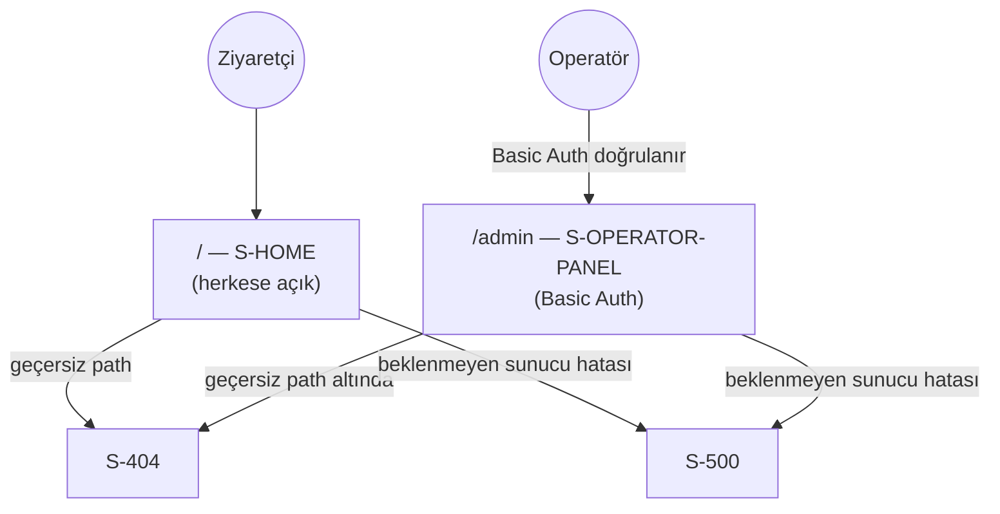

# 06. Ekran Kataloğu — Terazi

Terazi minimal bir ekran setine sahiptir — [P-001]/[P-002] gereği tek işlevli, hesapsız bir vitrin uygulaması olduğu için klasik anlamda çok ekranlı bir bilgi mimarisi (IA) yoktur. Toplam **4 ekran**: 2 kritik (tam işlevsel), 2 ikincil (hata durumu).

## 1. Ekran Haritası ve Navigasyon

- Navigasyon tek yönlüdür — S-HOME'dan S-OPERATOR-PANEL'e (veya tersine) bir link/menü **yoktur** ([AP-002] gereği panel bilinçli olarak keşfedilebilir bir UI elemanı değildir, doğrudan `/admin` path'i bilinerek erişilir).
- S-HOME içinde alt-sayfa geçişi yoktur — filtre/dönem değişikliği aynı sayfada URL query güncellemesiyle olur (bkz. `05_FRONTEND_SPEC.md §2`).

## 2. Layout Tanımları

| Layout | Kullanıldığı ekranlar | İçerik |
| --- | --- | --- |
| **Kök layout** (`app/layout.tsx`) | S-HOME, S-404, S-500 | Üst başlık ("Terazi" logosu/adı, tık ile ana sayfaya döner), içerik alanı, sabit `DisclaimerFooter` ([P-006]) |
| **Operatör layout** (`app/admin/layout.tsx`) | S-OPERATOR-PANEL | Sade başlık ("Terazi — Operatör Paneli"), kullanıcıya yönelik navigasyon/branding içermez, `DisclaimerFooter` içermez (operatöre yönelik, yatırımcıya değil) |

## 3. Ekran ID Konvansiyonu

Format: `S-<DOMAIN>-<ACTION>` veya tek kelimelik domain'ler için `S-<DOMAIN>`. Bu projede domain sayısı az olduğu için çoğu ID tek segment taşır: `S-HOME`, `S-OPERATOR-PANEL`, `S-404`, `S-500`.

## 4. Kritik Ekranlar — Tam Şablon

### S-HOME

| Alan | Değer |
| --- | --- |
| **Route** | `/` |
| **Layout** | Kök layout |
| **Erişim yetkisi** | Herkese açık, kimlik doğrulama yok |
| **Amaç** | Varlık sınıflarının reel/nominal getirisini karşılaştırmalı tablo ve normalize edilmiş grafik ile göstermek |

**Alan listesi (filtre kontrolleri):**

| Etiket | Tip | Zorunlu | Validation |
| --- | --- | --- | --- |
| Varlık sınıfı filtresi | Çoklu seçim (checkbox grubu: Döviz/Altın/Kripto/Yatırım Fonu) | Hayır | Yok — hiçbiri seçilmezse tümü gösterilir |
| Dönem seçici | Tekli seçim (segmented control: 1A/3A/1Y/3Y/5Y) | Evet | Sabit 5 değerden biri, varsayılan "1Y" |
| Grafik için varlık seçimi | Çoklu seçim (arama yapılabilir dropdown) | Hayır (grafik boşsa gösterilmez) | Minimum 2, maksimum 5 — 5. seçimden sonra diğer seçenekler UI'da disabled |
| Tablo sıralama | Kolon başlığına tıklama (nominal getiri / reel getiri / sembol) | Hayır | Varsayılan: reel getiriye göre azalan |

**Aksiyonlar ve sonuçları:**
- Varlık sınıfı/dönem değişimi → tablo ve (varsa) grafik anında yeniden çekilir (`GET /api/comparison`, `GET /api/comparison/series`), URL query güncellenir.
- Tablo kolon başlığına tıklama → yalnızca client-side yeniden sıralama (ek API çağrısı gerekmez, veri zaten bellekte).
- Grafik varlık seçimine 6. varlık eklemeye çalışma → engellenir, kullanıcıya "En fazla 5 varlık karşılaştırabilirsiniz" tooltip'i gösterilir.

**UX state'leri:**
| State | Görünüm |
| --- | --- |
| Boş (empty) | Seçili dönem/varlık kombinasyonu için hiç veri yoksa: "Bu dönem için veri bulunamadı." mesajı, tablo satırları yerine tek bir bilgi satırı |
| Yükleniyor (loading) | İlk yüklemede tam sayfa skeleton (Server Component ile SSR edildiği için pratikte çok kısa); filtre değişiminde yalnızca tablo/grafik alanında skeleton, sayfanın geri kalanı sabit kalır |
| Hata (error) | Kırmızı banner: "Veriler yüklenirken bir sorun oluştu." + "Tekrar dene" butonu; önceki (varsa) veri ekranda kalmaya devam eder, tamamen boşalmaz |
| Yetkisiz | Uygulanmaz (herkese açık ekran) |
| Başarı | Tablo satırları `status="ok"` için normal görünür; `status="unavailable"` satırlar gri, "Veri yok" etiketiyle, sıralamanın en altında gösterilir |

**Kullanılan endpoint'ler:** `GET /api/asset-classes`, `GET /api/assets`, `GET /api/comparison`, `GET /api/comparison/series`

**TR mesaj metinleri:**
- Sabit uyarı (her zaman görünür, footer): *"Geçmiş performans gelecekteki getiriyi göstermez. Bu sayfadaki bilgiler yatırım tavsiyesi niteliği taşımaz."*
- Boş durum: *"Bu dönem için veri bulunamadı."*
- Hata durumu: *"Veriler yüklenirken bir sorun oluştu."* + buton: *"Tekrar dene"*
- Grafik seçim sınırı: *"En fazla 5 varlık karşılaştırabilirsiniz."*
- Veri yok satırı: *"Veri yok"*

---

### S-OPERATOR-PANEL

| Alan | Değer |
| --- | --- |
| **Route** | `/admin` |
| **Layout** | Operatör layout |
| **Erişim yetkisi** | HTTP Basic Auth (`OPERATOR_USERNAME`/`OPERATOR_PASSWORD`) — [AP-002] |
| **Amaç** | Veri toplama job'larının çalışma geçmişini ve her kaynağın sağlık durumunu göstermek |

**Alan listesi:**

| Etiket | Tip | Zorunlu | Validation |
| --- | --- | --- | --- |
| Kaynak filtresi | Tekli seçim (Tümü/TCMB/TEFAS/CoinGecko) | Hayır | Sabit 4 değerden biri, varsayılan "Tümü" |

**Görüntülenen bilgi (salt okunur, form değildir):**
- **Kaynak sağlık kartları** (3 kart: TCMB, TEFAS, CoinGecko) — her biri: son başarılı çalışma zamanı, mevcut durum rozeti (Başarılı/Kısmi/Hata/Bekliyor), `isStale=true` ise kartın kenarlığı turuncu vurgulu.
- **Job çalıştırma geçmişi tablosu** — kaynak, durum, başlangıç/bitiş zamanı, işlenen kayıt sayısı, hata mesajı (varsa) kolonları; en yeni çalıştırma en üstte.

**Aksiyonlar ve sonuçları:**
- Kaynak filtresi değişimi → tablo `GET /api/admin/job-runs?dataSource=...` ile yeniden çekilir.
- Bu ekranda hiçbir yazma aksiyonu yoktur (job tetikleme/durdurma butonu v1 kapsamında yoktur — job'lar yalnızca harici cron ile tetiklenir, [TS-004]).

**UX state'leri:**
| State | Görünüm |
| --- | --- |
| Boş (empty) | Seçili kaynak için hiç çalıştırma kaydı yoksa: "Henüz çalıştırma kaydı yok." |
| Yükleniyor (loading) | Kart ve tablo alanlarında skeleton |
| Hata (error) | "Veriler yüklenemedi." banner'ı + "Tekrar dene" |
| Yetkisiz | Basic Auth header eksik/hatalıysa sayfa hiç render edilmez, tarayıcı native kimlik doğrulama diyaloğu gösterilir (bkz. `05_FRONTEND_SPEC.md §2`) |
| Başarı | Kartlar ve tablo dolu; `isStale=true` kaynaklar görsel olarak vurgulanır |

**Kullanılan endpoint'ler:** `GET /api/admin/job-runs`, `GET /api/admin/sources`

**TR mesaj metinleri:**
- Boş durum: *"Henüz çalıştırma kaydı yok."*
- Hata durumu: *"Veriler yüklenemedi."* + buton: *"Tekrar dene"*
- Durum rozetleri: *"Başarılı"*, *"Kısmi Başarı"*, *"Hata"*, *"Bekliyor"*, *"Çalışıyor"*
- Tazelik uyarısı (kart üzerinde, `isStale=true` ise): *"Beklenen güncelleme takviminden gecikmiş."*

## 5. İkincil Ekranlar — Kısa Şablon

### S-404

- **Route:** Next.js `not-found.tsx` (eşleşmeyen tüm path'ler)
- **Yetki:** Herkese açık
- **Amaç:** Var olmayan bir sayfaya gidildiğini bildirmek
- **Ana aksiyonlar:** "Ana sayfaya dön" linki (`/`)
- **Endpoint'ler:** Yok
- **Metin:** *"Aradığınız sayfa bulunamadı."*

### S-500

- **Route:** Next.js `error.tsx` (route segment hata sınırı)
- **Yetki:** Herkese açık
- **Amaç:** Beklenmeyen bir render/sunucu hatasında kullanıcıya nazik bir hata ekranı göstermek (beyaz ekran yerine)
- **Ana aksiyonlar:** "Sayfayı yenile" butonu (Next.js `reset()` fonksiyonunu çağırır)
- **Endpoint'ler:** Yok
- **Metin:** *"Bir şeyler ters gitti. Lütfen tekrar deneyin."*

## 6. Ortak Bileşenler ve Boş/Hata/Yükleniyor Durumları

| Bileşen | Kullanıldığı ekranlar | Sorumluluk |
| --- | --- | --- |
| `DisclaimerFooter` | S-HOME, S-404, S-500 | [P-006] sabit uyarı metni — her sayfada aynı bileşenden render edilir, metin kopyalanmaz |
| `DataState` | S-HOME, S-OPERATOR-PANEL | `loading`/`error`/`empty`/`success` durumlarını tek noktadan yöneten wrapper (bkz. `05_FRONTEND_SPEC.md §4`) — her yeni veri-çeken component bu dört durumu ad-hoc yeniden yazmaz |
| `StatusBadge` | S-OPERATOR-PANEL (job durumu), S-HOME (tablo satırı `status`) | Renk + metin kombinasyonuyla durum gösterimi; renk tek başına anlam taşımaz (bkz. `05_FRONTEND_SPEC.md §8`) |

**Genel kural:** Boş/hata/yükleniyor durumları için her yeni ekran, yukarıdaki `DataState` bileşenini yeniden kullanır; yeni bir ekran kendi ad-hoc boş/hata metni yazmadan önce bu bileşenin genişletilip genişletilemeyeceği değerlendirilir.
