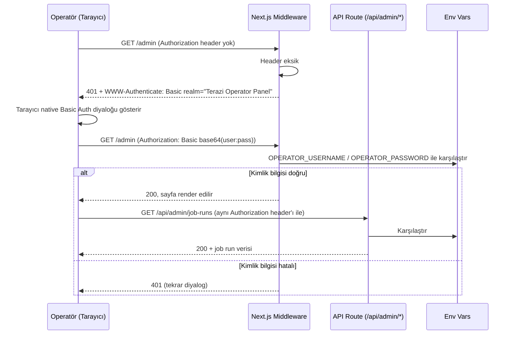

# 07. Güvenlik Uygulaması — Terazi

## 1. Güvenlik Hedef Seviyesi ve Threat Model Özeti

**Hedef seviye:** Pragmatik/temel güvenlik. OWASP Top 10 temel önlemleri (input validation, secrets yönetimi, HTTP güvenlik başlıkları, dependency taraması) uygulanır. Ağır uyum çerçeveleri (OWASP ASVS L2+, ISO 27001) hedeflenmez — sistemde kullanıcı hesabı/PII yoktur, ölçek küçüktür, ağır uyum yükü bu risk profiliyle orantısız olurdu.

**Threat model özeti (kısa):**

| Tehdit | Olasılık | Etki | Azaltım |
| --- | --- | --- | --- |
| TEFAS'ın kırılgan endpoint'inden bozuk/kötü niyetli veri sızması | Orta | Düşük-Orta (yanlış getiri gösterimi) | Şema doğrulama (§6), job'un veriyi atlayıp `partial` işaretlemesi |
| Operatör paneli credential brute-force | Düşük | Orta (iç veri görünürlüğü sızar, yazma yetkisi yok) | Rate limit (§8), Basic Auth |
| Genel API'ye scraping/aşırı istek | Orta | Düşük (küçük ölçek, veri zaten public) | IP bazlı rate limit (§8) |
| Secrets'ın kod tabanına/log'a sızması | Düşük | Yüksek (dış API key'lerinin iptali gerekir) | Env var zorunluluğu, log maskeleme (§9) |
| SQL injection | Düşük (Prisma parametrik sorgu) | Yüksek | ORM kullanımı, elle SQL yazılmaz (§6) |

Sistemde kullanıcı hesabı, oturum, kişisel veri veya finansal işlem olmadığı için ([P-002]) klasik "hesap ele geçirme" veya "veri sızıntısı" (PII) tehdit sınıfları bu threat model'de yoktur.

## 2. Kimlik Doğrulama Akışı

Sistemde **iki** kimlik doğrulama bağlamı vardır: (a) anonim ziyaretçi için **yok**, (b) operatör paneli için **HTTP Basic Auth**.

**(a) Anonim ziyaretçi:** Kimlik doğrulama akışı yoktur; `/` ve tüm public API'ler doğrudan erişilebilir.

**(b) Operatör paneli login akışı:**

- **"Login"** ayrı bir form/endpoint değildir — tarayıcının native Basic Auth diyaloğudur.
- **"Refresh"** yoktur — Basic Auth stateless'tir, her istek kendi `Authorization` header'ını taşır, süre dolması diye bir kavram yoktur.
- **"Logout"** klasik anlamda yoktur (silinecek bir session/cookie yok); operatör tarayıcısını kapatana/credential cache'ini temizleyene kadar tarayıcı header'ı otomatik ekler. Bu, Basic Auth'un bilinen bir sınırlamasıdır ve [AP-002]'de bilinçli olarak kabul edilmiştir (tersinirlik ve kod sadeliği tercih sebebidir).

## 3. Token/Session Yönetimi

Token veya session **yoktur**. Basic Auth credential'ı her istekte `Authorization` header'ında taşınır, sunucu tarafında hiçbir state (session store, JWT, cookie) tutulmaz. Bu, sistemin genel "hesapsız" mimarisiyle ([P-002]) tutarlıdır — operatör paneli de bu ilkeden ayrı bir istisna oluşturmaz, yalnızca ek bir header kontrolü ekler.

**Invalidation:** Credential'ı geçersiz kılmanın tek yolu `OPERATOR_PASSWORD` ortam değişkenini değiştirip yeniden deploy etmektir — kod içinde bir "credential iptal et" mekanizması yoktur.

## 4. Yetkilendirme Uygulaması

- **Kontrol nerede zorlanır:** İki katmanda, birbirinden bağımsız olarak — (1) `apps/web/middleware.ts` sayfa (`/admin/**`) seviyesinde, (2) `withAdminAuth` higher-order function API route (`/api/admin/**`) seviyesinde (bkz. `04_BACKEND_SPEC.md §4`). İkisi de aynı env var karşılaştırmasını yapar; biri atlanırsa diğeri yine de korumayı sağlar (defense in depth).
- **Deny davranışı:** Varsayılan **deny** — `/admin` veya `/api/admin/*` altındaki her yeni route, açıkça `withAdminAuth`/middleware eşleşmesine dahil edilmediği sürece bu path prefix'i zaten middleware matcher'ı ile kapsanır (path bazlı, allow-list değil deny-by-default yapı: middleware `matcher: ['/admin/:path*']` ve tüm `/api/admin/*` route handler'ları zorunlu olarak `withAdminAuth` ile sarmalanır — bu sarmalamayı unutmak kod review checklist'inde ([CODE-005]) kontrol edilir).
- **Roller yoktur** — operatör tek bir yetki seviyesidir, granüler izin (superadmin/editor vb.) modellenmez ([P-002] kapsamı).

## 5. Veri Sınıflandırma ve Şifreleme

İki sınıf: **Gizli** ve **Public** ([SEC-002]).

| Sınıf | Kapsam | Saklama | Şifreleme |
| --- | --- | --- | --- |
| **Gizli** | `TCMB_EVDS_API_KEY`, `COINGECKO_API_KEY`, `OPERATOR_USERNAME`, `OPERATOR_PASSWORD` | Ortam değişkenleri (Vercel/Railway secret store) | Platformun kendi secret store şifrelemesi (at-rest); ayrıca uygulama seviyesinde şifreleme eklenmez |
| **Public** | `asset_classes`, `assets`, `asset_prices`, `cpi_index`, `job_runs` tablolarındaki tüm veri | PostgreSQL (Railway) | Şifreleme gerekmez — veri zaten herkese açık piyasa verisidir |

KVKK'ya konu bir kişisel veri sınıfı **yoktur** çünkü v1'de kişisel veri toplanmaz ([P-002], [S-004]) — bkz. §11.

## 6. Input Validation ve Dosya Yükleme Güvenliği

- **Dosya yükleme:** Yoktur, hiçbir endpoint `multipart/form-data` kabul etmez.
- **Kullanıcıdan gelen input:** Tüm API query parametreleri (`assets`, `period`, `sortBy`, `sortDir`, `assetClass`, `dataSource`, `limit`) Zod şema bazlı whitelist doğrulamadan geçer ([SEC-006]); tanınmayan/geçersiz değerler `400 VALIDATION_ERROR` döner (bkz. `03_API_CONTRACTS.md §3`). Serbest metin girişi kabul eden hiçbir alan yoktur (tüm parametreler enum veya sabit formatlı, örn. `symbol`).
- **SQL injection:** Prisma ORM parametrik sorgu kullanır; hiçbir katmanda ham SQL string birleştirme (`$queryRawUnsafe` vb.) yapılmaz. Ham SQL gerekiyorsa (performans nedeniyle) yalnızca `$queryRaw` template literal (parametrize) kullanılır.
- **Dış kaynak yanıt doğrulaması ([SEC-007]):** TCMB EVDS/TEFAS/CoinGecko'dan gelen her yanıt, DB'ye yazılmadan önce ilgili Zod şemasıyla (`schemas/external/*.ts`) doğrulanır. Beklenmeyen format job'u sessizce bozmaz — hatalı kayıt atlanır, `JobRun.status='partial'`, hata loglanır (bkz. `01_DOMAIN_MODEL.md §5`, `04_BACKEND_SPEC.md §5`). Bu kontrol özellikle TEFAS için kritiktir (resmî olmayan, kırılgan kaynak).

## 7. HTTP Güvenlik Başlıkları

| Başlık | Değer/Politika |
| --- | --- |
| `Content-Security-Policy` | `default-src 'self'; script-src 'self'; style-src 'self' 'unsafe-inline'; img-src 'self' data:; connect-src 'self'` — dış script/iframe kaynağı yok, ürün üçüncü parti embed içermez |
| `X-Content-Type-Options` | `nosniff` |
| `X-Frame-Options` | `DENY` (site başka bir sayfaya iframe içinde gömülemez) |
| `Referrer-Policy` | `strict-origin-when-cross-origin` |
| `Strict-Transport-Security` | `max-age=63072000; includeSubDomains` (Vercel/Railway HTTPS'i zaten zorunlu kılar, bu başlık tarayıcıya pekiştirir) |
| `CORS` | Yalnızca kendi frontend origin'ine izin verilir (`Access-Control-Allow-Origin` production domain'i ile sabitlenir); wildcard (`*`) kullanılmaz |

`Content-Security-Policy` HARİÇ tüm başlıklar Next.js `next.config.js` içindeki `headers()` fonksiyonu ile tüm route'lara merkezi olarak uygulanır — her route handler kendi başlıklarını elle eklemez.

`Content-Security-Policy` istisnadır: Next.js App Router'ın kendi ürettiği RSC hydration script'leri (`self.__next_f.push(...)`) inline'dır ve `script-src`'de `'unsafe-inline'` kullanılması yasak olduğu için (bu tablonun üstündeki satır), `next.config.js`'in statik `headers()`'ı ile CSP üretilemez — statik bir CSP, Next.js'in kendi script'lerini de bloke eder (2026-08-18, İterasyon 3/§5.3'te E2E smoke testleriyle doğrulandı). Bunun yerine CSP, `apps/web/middleware.ts`'te HER istekte taze bir nonce ile üretilir (`script-src 'self' 'nonce-<rastgele>' 'strict-dynamic'`) — Next.js'in resmi nonce tabanlı CSP deseni (bkz. Next.js docs "Content Security Policy"). Middleware tüm route'larda çalışır (yalnızca `_next/static`/`_next/image`/`favicon.ico` hariç), böylece CSP hâlâ TEK merkezden (bu middleware) üretilir, route bazında ayrıca tanımlanmaz (`.claude/rules/03-security-baseline.md` kontrol #6 ile tutarlı — merkezi nokta `next.config.js`'ten `middleware.ts`'e kaydı).

İki ek nokta (İterasyon 3/§5.3'te E2E ile doğrulandı, PR #26):
- **`'strict-dynamic'` zorunlu:** `next/dynamic` ile lazy-load edilen chunk'lar (ör. `ReturnChart`/Recharts, `05_FRONTEND_SPEC.md` bundle boyutu için lazy-load) webpack'in çalışma zamanı chunk loader'ı tarafından SONRADAN enjekte edilir ve nonce TAŞIMAZ; `'strict-dynamic'` olmadan tarayıcı bu chunk'ları bloke eder.
- **`'unsafe-eval'` yalnızca `NODE_ENV=development`'ta eklenir:** `next dev`'in Fast Refresh'i modülleri `eval()` ile sarar (yalnızca geliştirme sunucusu, `next build`/`next start`'ta YOKTUR). Bu olmadan `next dev` kullanan her ortam (lokal geliştirme, Playwright smoke e2e) tüm client-side JS'i CSP ihlaliyle bloke eder. Production'da asla eklenmez.

## 8. Rate Limiting ve Brute-Force Koruması

Bkz. `03_API_CONTRACTS.md §6` (tam tablo). Özet:

- Genel API: IP başına dakikada 60 istek.
- `/api/admin/*` başarısız Basic Auth denemesi: IP başına dakikada 10 deneme — bu eşik aşılırsa doğru kimlik bilgisiyle bile 429 döner (brute-force penceresi kapatılır, [S-003]'teki "ekstra sertleştirme yok" ilkesiyle uyumlu minimal bir koruma).
- Sayaçlar uygulama içi bellekte tutulur; ayrı bir Redis kurulmaz.

## 9. Secrets Yönetimi

- Dış API key'leri ve operatör paneli credential'ı yalnızca ortam değişkenlerinde tutulur; kod tabanına, `git` geçmişine, log satırına veya commit mesajına asla yazılmaz ([SEC-003], [CODE-001] madde 6).
- `.env.example` dosyası tüm gerekli değişkenleri placeholder değerlerle listeler (bkz. `04_BACKEND_SPEC.md §10`); gerçek değerler yalnızca Vercel/Railway'in kendi secret store'u üzerinden enjekte edilir.
- Log middleware'i `OPERATOR_PASSWORD`, `OPERATOR_USERNAME`, `TCMB_EVDS_API_KEY`, `COINGECKO_API_KEY` ve `Authorization` header değerlerini otomatik olarak `***` ile maskeler — geliştirici elle maskeleme yapmayı unutsa bile bu alanlar loglanmaz.
- Ayrı bir secret manager servisi (Vault vb.) kurulmaz — tek geliştirici/vitrin ölçeğinde orantısız karmaşıklık ekler.

## 10. Audit Log

Klasik "kim-ne-yaptı" audit log'u **yoktur** — sistemde kullanıcı hesabı/eylemi olmadığı için ([P-002]) konusu yoktur. Bunun yerine `job_runs` tablosu **operasyonel** bir çalışma geçmişi sağlar (bkz. `01_DOMAIN_MODEL.md §2.5`, `02_DATABASE_SCHEMA.md §2.5`):

- Hangi olay: her worker job çalıştırması (kaynak, durum, süre, işlenen kayıt sayısı, hata mesajı).
- Kim görür: yalnızca operatör (Basic Auth arkasında, `S-OPERATOR-PANEL`).
- Tamper-evidence: yoktur (append-only ama kriptografik imza/hash zinciri kurulmaz) — bu ölçekte (tek geliştirici, iç kullanım) gerekli görülmemiştir.
- Bu tablo bir güvenlik audit'i değil, gözlemlenebilirlik (observability) aracıdır.

## 11. KVKK/GDPR Veri Hakları ve Saklama Süreleri

v1'de kişisel veri işlenmediği için ([P-002], [S-004]) aşağıdaki yükümlülükler **uygulanmaz**:

- Veri sahibi hakları (erişim, düzeltme, silme talebi) — işlenen bir kişisel veri olmadığı için talep edilecek bir şey yoktur.
- Aydınlatma metni / açık rıza akışı — çerez bandı veya KVKK metni v1'de gösterilmez (analytics/tracking yok, [S-004]).
- Veri saklama süresi politikası — `asset_prices`/`cpi_index`/`job_runs` piyasa/operasyonel veridir, kişisel veri saklama süresi kısıtına tabi değildir; süresiz saklanır (bkz. `02_DATABASE_SCHEMA.md §7`).

**Yeniden değerlendirme koşulu:** Bu bölüm yalnızca kullanıcı hesabı, analytics veya benzeri bir kişisel veri toplama özelliği eklenirse yeniden değerlendirilir — o zamana kadar durum "kapsam dışı, çünkü konu yok" statüsündedir. Böyle bir özellik eklenmeden önce `docs/00_PROJECT_OVERVIEW.md` ve bu bölüm güncellenir.

## 12. Incident Response ve Alarm Eşikleri

Ayrı bir APM/error-tracking servisi (Sentry, Datadog vb.) **kurulmaz** ([INF-003]). İzleme ve eşikler `job_runs` tablosu ve operatör panelinin kendisi üzerinden manuel olarak takip edilir:

| Eşik | Durum | Operatörün beklenen aksiyonu |
| --- | --- | --- |
| Bir kaynağın `isStale=true` olması (beklenen takvimden gecikme) | Uyarı | Operatör paneline bakıp kaynağın loglarını (Railway) inceler |
| Ard arda 3 `failed` job (aynı kaynak) | Ciddi | Dış kaynağın API'sinde/erişiminde kalıcı bir sorun olabileceği manuel kontrol edilir |
| `/api/admin/*` üzerinde rate limit tetiklenmesi (dakikada 10+ başarısız Basic Auth denemesi) | Güvenlik sinyali | Railway/Vercel access log'ları üzerinden IP incelenir; otomatik IP banlama v1 kapsamında yoktur |

Otomatik alarm (e-posta/SMS/Slack bildirimi) **yoktur** — bu [P-008]'deki "bildirim sistemi kapsam dışı" kararıyla tutarlıdır; operatör paneli periyodik manuel kontrol için tasarlanmıştır.

---

## Executable Checklist (downstream `.claude/rules/03-security-baseline.md` için)

1. Hiçbir endpoint kullanıcıdan gelen veriyi Zod şeması olmadan işlemez (§6).
2. `/api/admin/*` ve `/admin/**` her zaman `withAdminAuth`/middleware ile korunur; yeni bir admin route eklerken bu sarmalama atlanmaz (§4).
3. Secrets (API key, operatör credential'ı) kod, log veya commit mesajına asla yazılmaz; log middleware'indeki maskeleme listesi yeni bir secret eklendiğinde güncellenir (§9).
4. Dış kaynaktan (TCMB/TEFAS/CoinGecko) gelen her yanıt DB'ye yazılmadan önce şema doğrulamasından geçer; doğrulama atlanmaz (§6).
5. Tüm SQL erişimi Prisma üzerinden, parametrik sorgu ile yapılır; ham string birleştirme yasaktır (§6).
6. Yeni bir response header/CORS değişikliği `next.config.js` merkezi konfigürasyonundan yapılır, route bazında ayrıca tanımlanmaz (§7).
