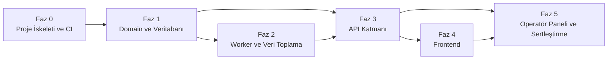

# 10. Uygulama Yol Haritası — Terazi

## 1. Çalışma Modeli

- **1 chat ≈ 1 PR ≈ 1 alt madde (§N.M).** Her `phase-creator` iterasyonu, bu dokümandaki tek bir `§N.M` alt maddesine karşılık gelir ve tek bir PR ile teslim edilir. Bir chat oturumu birden fazla alt maddeyi karıştırmaz.
- Bir alt madde "tamamlandı" sayılmadan önce `09_DEV_WORKFLOW.md §3`'teki PR kontrol listesi (test, coverage, güvenlik yasak listesi, docs güncelliği, CI yeşil) tam olarak sağlanmalıdır.
- Fazlar sırayla ilerler; bir fazın alt maddeleri, o fazın önceki alt maddeleri tamamlanmadan başlatılmaz (bkz. §2 bağımlılık sırası). Fazlar arası atlama yapılmaz — örn. Faz 3 (API), Faz 1'in (DB şema) ve Faz 2'nin (worker verisi olmadan) test edilebilir şekilde tamamlanamaz.
- Her faz sonunda bir **human gate** vardır (bkz. §4); agent onaysız bir sonraki faza geçmez.

## 2. Faz Listesi ve Bağımlılık Sırası

| Faz | Başlık | Bağımlılık | Neden bu sıra |
| --- | --- | --- | --- |
| 0 | Proje İskeleti ve CI | — | Her şeyin üzerine kurulduğu temel |
| 1 | Domain ve Veritabanı | Faz 0 | [P-004] ilkesi — veri katmanı önce gelir |
| 2 | Worker ve Veri Toplama | Faz 1 | Şema olmadan job yazılamaz |
| 3 | API Katmanı | Faz 1 (şema), Faz 2 (gerçek veri ile test için) | API, hem şemaya hem örnek veriye ihtiyaç duyar |
| 4 | Frontend | Faz 3 | UI, API sözleşmesi sabitlenmeden inşa edilmez |
| 5 | Operatör Paneli ve Sertleştirme | Faz 3 (admin endpoint'leri), Faz 4 (UI kalıpları) | Operatör paneli hem API hem UI kalıplarını yeniden kullanır; sertleştirme tüm sistem ayaktayken anlamlıdır |

## 3. Faz Detayları

### Faz 0 — Proje İskeleti ve CI

**§0.1 — Monorepo kurulumu**
pnpm workspaces ile `apps/web`, `apps/worker`, `packages/core` boş iskeletleri (`04_BACKEND_SPEC.md §2` klasör ağacı). Her paketin kendi `package.json`'ı, kök `pnpm-workspace.yaml`.

**§0.2 — Ortak TypeScript/Lint/Format konfigürasyonu**
Kök `tsconfig.base.json`, ESLint + Prettier kuralları (`CODE-003` naming convention'ları lint kuralına yansıtılır).

**§0.3 — GitHub Actions CI iskeleti**
`lint` + `build` job'ları (henüz test yok, Faz 1'de eklenecek) — `INF-002`.

**§0.4 — Local ortam**
Docker Compose (lokal Postgres), `.env.example` (`04_BACKEND_SPEC.md §10` tablosundaki tüm değişkenler placeholder ile).

---

### Faz 1 — Domain ve Veritabanı

**§1.1 — Prisma schema ve ilk migration**
`02_DATABASE_SCHEMA.md §2`'deki 5 tablo (`asset_classes`, `assets`, `asset_prices`, `cpi_index`, `job_runs`), tüm constraint/index'ler (§4, §5).

**§1.2 — Zod şemaları**
`packages/core/src/schemas/api/*.ts` (query parametreleri) ve `schemas/external/*.ts` (TCMB/TEFAS/CoinGecko yanıt şemaları) — `03_API_CONTRACTS.md` ve `SEC-007`'deki alan sözleşmeleriyle birebir.

**§1.3 — Seed script**
`asset_classes` (4 satır) + `assets` (USD/TRY, EUR/TRY, XAUTRY, BTC, ETH, SOL, BNB, XRP + TEFAS kategori başına 15 fon) — `02_DATABASE_SCHEMA.md §9`.

**§1.4 — Hesaplama fonksiyonları ve unit testler**
`real-return.ts`, `normalized-return.ts` (`01_DOMAIN_MODEL.md §6` formülleri) + Vitest unit testleri, `packages/core` için %90+ coverage hedefi ilk kez bu iterasyonda karşılanmalı.

**Bu fazın CI gate'i:** `test` job'u CI'a eklenir (Vitest), Faz 1 sonundan itibaren coverage eşikleri zorunlu hale gelir.

---

### Faz 2 — Worker ve Veri Toplama

**§2.1 — TCMB EVDS client ve job**
`clients/tcmb-client.ts` + `jobs/tcmb-job.ts`; fixture tabanlı integration test (`08_TESTING_STRATEGY.md §5`).

**§2.2 — TEFAS client ve job**
`clients/tefas-client.ts` + `jobs/tefas-job.ts`; bozuk veri fixture'larıyla `partial` durum testi — bu iterasyon [SEC-007]'nin en kritik uygulama noktasıdır.

**§2.3 — CoinGecko client ve job**
`clients/coingecko-client.ts` + `jobs/coingecko-job.ts`; 5 coin (BTC, ETH, SOL, BNB, XRP) için fixture testi.

**§2.4 — JobRun state machine ve retry/backoff**
`01_DOMAIN_MODEL.md §5`'teki durum geçişlerinin ortak implementasyonu (üç job da aynı yardımcı fonksiyonu kullanır), exponansiyel backoff (`04_BACKEND_SPEC.md §8`), idempotent upsert testi (aynı job'un iki kez çalıştırılması).

**§2.5 — Railway cron konfigürasyonu**
Üç job'un zamanlanması (`04_BACKEND_SPEC.md §8` saatleri) + staging ortamında gerçek bir çalıştırmanın doğrulanması (fixture değil, gerçek dış API — yalnızca bu iterasyonda, tek seferlik manuel doğrulama amaçlı).

---

### Faz 3 — API Katmanı

**§3.1 — Referans veri endpoint'leri**
`GET /api/asset-classes`, `GET /api/assets` (`03_API_CONTRACTS.md §5.1`).

**§3.2 — Karşılaştırma tablosu endpoint'i**
`GET /api/comparison` — servis katmanının `real-return.ts`'i çağırarak satırları ürettiği ana entegrasyon noktası (`§5.2`).

**§3.3 — Grafik endpoint'i**
`GET /api/comparison/series` — `normalized-return.ts` entegrasyonu (`§5.2`).

**§3.4 — Health endpoint'i**
`GET /api/health` (`§5.4`).

**§3.5 — Middleware zinciri ve integration testleri**
`withRateLimit`, `withValidation`, `withErrorHandling` (`04_BACKEND_SPEC.md §4`) + `08_TESTING_STRATEGY.md §4`'teki negatif senaryoların tamamı bu iterasyonda test edilir.

---

### Faz 4 — Frontend

**§4.1 — Kök layout ve tasarım temeli**
Tailwind + shadcn/ui kurulumu, kök `layout.tsx`, `DisclaimerFooter` bileşeni (`P-006` sabit uyarı, tüm sayfalarda).

**§4.2 — Karşılaştırma tablosu**
`ComparisonTable` (TanStack Table) + `PeriodSelector` + varlık sınıfı filtresi; URL query state senkronizasyonu (`05_FRONTEND_SPEC.md §2-3`).

**§4.3 — Normalize edilmiş getiri grafiği**
`ReturnChart` (Recharts, `next/dynamic` ile lazy-load) + `AssetSelector` (2-5 varlık kısıtı).

**§4.4 — Durum yönetimi ve hata ekranları**
`DataState` ortak bileşeni (loading/error/empty), `S-404`, `S-500` (`06_SCREEN_CATALOG.md §5`).

**§4.5 — Smoke e2e testleri**
Playwright ile `08_TESTING_STRATEGY.md §6`'daki kritik journey'ler (ana sayfa yükleme, varlık seçimi, dönem değişikliği).

---

### Faz 5 — Operatör Paneli ve Sertleştirme

**§5.1 — Admin API endpoint'leri**
`GET /api/admin/job-runs`, `GET /api/admin/sources` + `withAdminAuth` middleware (`07_SECURITY_IMPLEMENTATION.md §2-4`).

**§5.2 — Operatör paneli ekranı**
`S-OPERATOR-PANEL` — `JobRunTable`, `SourceHealthCard`, Next.js Middleware ile `/admin` route koruması (`06_SCREEN_CATALOG.md §4`).

**§5.3 — HTTP güvenlik başlıkları ve rate limit sertleştirmesi**
CSP/CORS/HSTS (`next.config.js`), IP bazlı rate limit + Basic Auth brute-force koruması (`07_SECURITY_IMPLEMENTATION.md §7-8`).

**§5.4 — Dependency taraması CI entegrasyonu**
Dependabot + `npm audit`/pnpm eşdeğeri (`SEC-008`).

**§5.5 — Coverage kapanışı**
`packages/core` %90+, `apps/web`/`apps/worker` %60+ eşiklerinin gerçek ölçümle doğrulanması; eksik kalan test grupları tamamlanır.

**§5.6 — Production go-live**
Staging'de tam doğrulama (tüm ekranlar, tüm job'lar en az bir kez gerçek veriyle çalışmış), production seed'in tek seferlik çalıştırılması, DNS/domain bağlama, go-live checklist'inin proje sahibiyle birlikte gözden geçirilmesi.

## 4. Human Gate Noktaları

| Gate | Ne zaman | Ne onaylanır |
| --- | --- | --- |
| Faz sonu merge onayı | Her fazın son alt maddesi tamamlandığında | `main`'e merge ([TEST-005]) — CI yeşil olması yeterli değildir |
| Mimari karar gerektiren sapma | Herhangi bir iterasyon sırasında planlanmamış bir mimari seçim gerektiğinde ortaya çıkarsa | Önce `docs/mimari-kararlar.md` güncellenir, sonra ilgili `docs/NN` dokümanı, sonra koda devam edilir |
| Faz 2 §2.5 gerçek API doğrulaması | Staging'de gerçek dış API'lere ilk canlı bağlantı | Kullanılan API key'lerin/quota'ların uygun olduğu proje sahibi tarafından teyit edilir |
| Faz 5 §5.6 production go-live | Tüm fazlar tamamlandıktan sonra | Proje sahibinin canlıya alma onayı — bu, projenin tamamının ilk kez gerçek kullanıcıya açılma anıdır |

## 5. Risk Kaydı

| Risk | Olasılık | Etki | Azaltım |
| --- | --- | --- | --- |
| TEFAS'ın resmî olmayan endpoint'inin habersiz değişmesi | Orta | Orta (fon verisi güncellenmez) | Şema doğrulama + `partial` durumu + operatör paneli görünürlüğü (Faz 2, Faz 5) |
| TCMB EVDS ücretsiz key'in rate limit'e takılması | Düşük | Düşük (günde 1 çekim, limit aşımı olası değil) | Job zamanlamasının sabit ve seyrek olması (`04_BACKEND_SPEC.md §8`) |
| CoinGecko ücretsiz katman kotasının aşılması | Düşük-Orta | Orta (kripto verisi güncellenmez) | 4 saatlik sabit döngü, 5 coin ile sınırlı istek hacmi |
| Tek geliştirici bandwidth'i (proje durması/gecikmesi) | Orta | Orta | Faz'ların bağımsız teslim edilebilir olması — yarım kalan bir faz bile önceki fazların değerini korur |
| Reel getiri hesabında ondalık hassasiyet hatası | Düşük (test ile azaltılıyor) | Yüksek (yanlış finansal bilgi) | %90+ coverage zorunluluğu, `DECIMAL` tipi zorunluluğu, kod review checklist'i |

## 6. Teknik Borç Kaydı (Bilinçli Ertelemeler)

| Erteleme | Gerekçe | Ne zaman yeniden değerlendirilir |
| --- | --- | --- |
| Basic Auth (gerçek bir auth sistemi yerine) operatör paneli için | [AP-002] — tek kullanıcı, düşük risk profili | Operatör sayısı 1'den fazlaya çıkarsa |
| Ayrı bir client-side cache kütüphanesi yok (TanStack Query vb.) | [P-004] sadelik ilkesi, HTTP cache yeterli | Trafik/etkileşim karmaşıklığı belirgin şekilde artarsa |
| APM/error-tracking servisi yok | [INF-003] — DB-içi `job_runs` yeterli kabul edildi | Kullanıcı sayısı/kritiklik artarsa |
| i18n altyapısı yok | [P-005] — v1 tek dil | Uluslararası kullanıcı hedeflenirse |
| Otomatik IP banlama / WAF yok | [S-003] — ekstra sertleştirme gereksiz görüldü | Somut bir kötüye kullanım örneği gözlemlenirse |

## 7. Başarı Metrikleri

`00_PROJECT_OVERVIEW.md §5`'teki hedeflerin bu roadmap'teki karşılığı:

- Faz 1 sonunda: `packages/core` coverage ilk kez %90+ ölçülür.
- Faz 3 sonunda: tüm public API endpoint'leri `03_API_CONTRACTS.md §9`'daki p95 hedeflerini staging'de karşılar.
- Faz 5 sonunda: tüm coverage eşikleri (%90/%60) karşılanır, CI main branch'te sürekli yeşil, go-live checklist'i tamamlanır.

## 8. Doküman Yaşam Döngüsü

Spec değişikliği her zaman şu sırayla yayılır — sıra atlanmaz:

1. `docs/mimari-kararlar.md` güncellenir (yeni/değişen karar ID'si ile).
2. İlgili `docs/00–10` dokümanı(ları) `docs-architect` ile yeniden üretilir veya elle güncellenir.
3. `.claude/rules/` ve `CLAUDE.md` (`rules-architect` çıktısı) güncellenir.
4. Etkilenen faz(lar)ın `phase-creator` skill'i yeniden çalıştırılır — halihazırda tamamlanmış fazlar geriye dönük değiştirilmez, yalnızca henüz başlamamış alt maddeler yeni spec'i yansıtır.

Bu sıranın tersine çalışılması (önce kod, sonra doküman) [CODE-005] madde 4'e aykırıdır.
